<div style="text-align: center;"></div>


------
<div style="font-family: 'Space Grotesk', monospace;">

# Redis Data Integration (RDI) Demo via PS Portal

This demo suite showcases Redis Data Integration and how it enables data migration and transformation between Redis and other systems. This example demonstrates how to facilitate data exchange between Redis and a PostgreSQL database.


### Use Case:

- <a href="#demo1">Ingest tracks from a music Postgres database to Redis</a>

------

# Topology

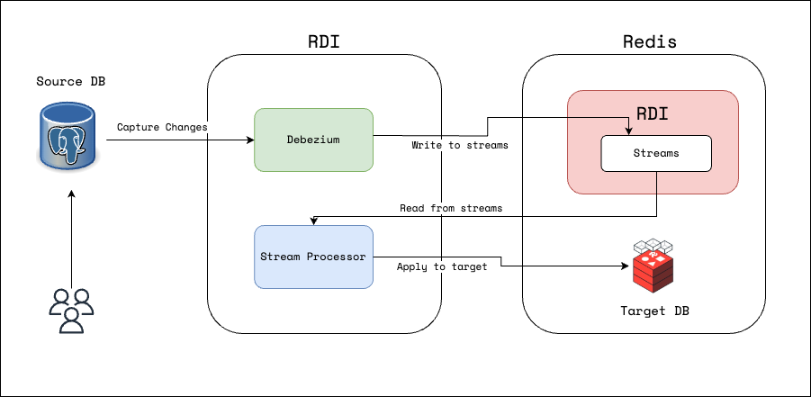

**Ingest Architecture in this environment.**

------

# Environment Details


| Resource                                                     | Details                                                      |
| ------------------------------------------------------------ | ------------------------------------------------------------ |
| <a href="https://7681-p-$HOSTNAME.$DOMAIN/" target="_blank">Terminal</a> | Access the Load generator VM                                 |
| <a href="https://8443-sp-$HOSTNAME.$DOMAIN/" target="_blank">Redis</a> | Version ${RE_VERSION}. Credentials: **admin@rl.org / redislabs** |
| <a href="https://3001-p-$HOSTNAME.$DOMAIN/" target="_blank">SQLPad</a> | Run queries against the Postgres database. Credentials: **admin@rl.org / redislabs** |
| <a href="https://5540-p-$HOSTNAME.$DOMAIN/" target="_blank">Redis Insight</a> | Redis Insight - Version ${REDIS_INSIGHT_VERSION}             |
| <a href="https://3000-p-$HOSTNAME.$DOMAIN/" target="_blank">Grafana</a> | Grafana - Version ${GRAFANA_VERSION}. Credentials: **admin / redislabs**             |
| <a href="https://9090-p-$HOSTNAME.$DOMAIN/" target="_blank">Prometheus</a> | Prometheus             |
| <a href="https://8081-p-$HOSTNAME.$DOMAIN/" target="_blank">Music App</a> | A Sample Application             |
| RDI                                                          | ${RDI_VERSION}                                               |


<h1 id="demo1">Demo 1: Ingest tracks from a music Postgres database to Redis</h1>

In this demo, we will configure RDI to ingest from a music track database stored in Postgres. It demonstrates how to use a transformation engine's job: it adds a field named NameUpper and filters records with GenreId=2.

### Step 1: Pre-check

- Open <a href="https://3001-p-$HOSTNAME.$DOMAIN/" target="_blank">SQLPad</a> and select the "Ingest-Postgres-DB" database connection. You should see the below.

  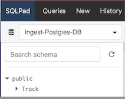

- Run a query against the 'Track' table and observe the current data present in the table.

  ```
  SELECT * FROM "Track"
  ```

  
- Open <a href="https://5540-p-$HOSTNAME.$DOMAIN/" target="_blank">Redis Insight</a>, accept all and add Add Redis database with the following inormation
  - Host:           **172.16.22.21**
  - Port:           **12000**
  - Database Alias: **target-db**
  - Click Test Connection, upon receiving a successful message, click on Add Redis database

- Open the target-db and observe there are no keys


### Step 2: Deploy RDI

- Open <a href="https://5540-p-$HOSTNAME.$DOMAIN/" target="_blank">Redis Insight</a>

- Select Redis Data Integration and then click Add RDI Endpoint.

  <div style="text-align: left;">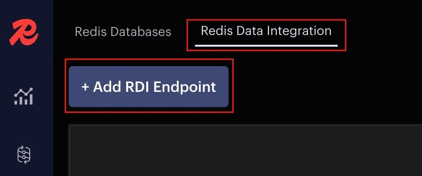</div>


- Enter the values as shown in the image below, replacing the IP address with **${HOST_IP}**, Password: **redislabs**

  <div style="text-align: left;">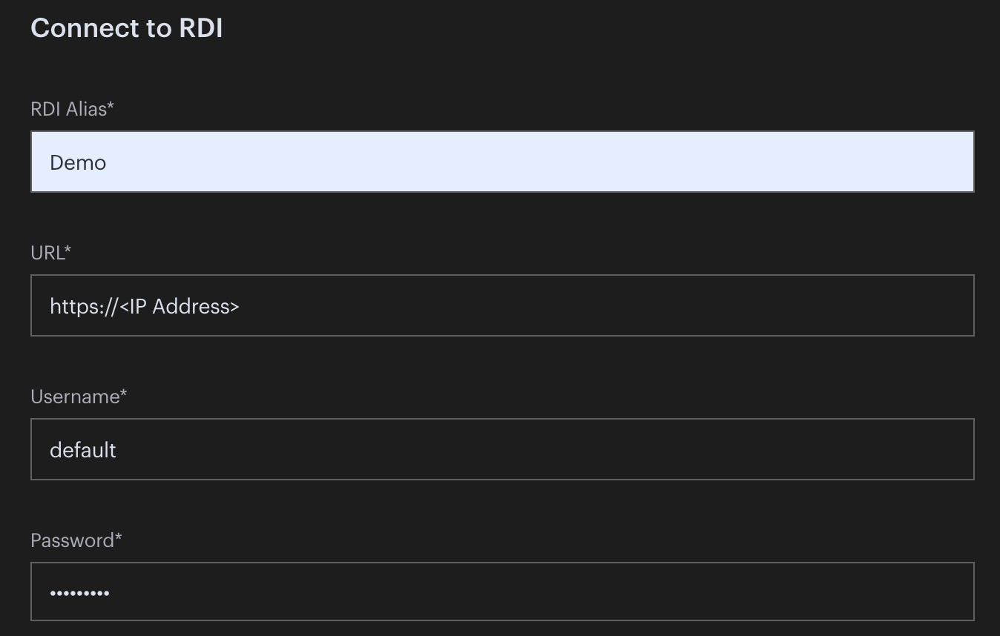</div>

  

- You will receive a confirmation below once it has been successfully added.

  <div style="text-align: left;">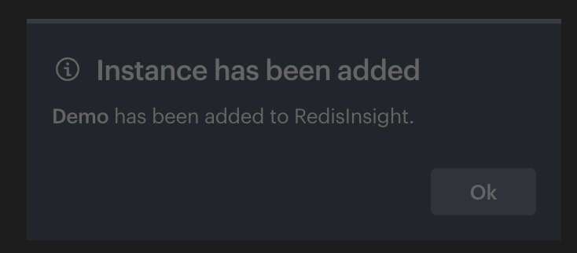</div>
  
- Select Create New Pipeline.

  <div style="text-align: left;">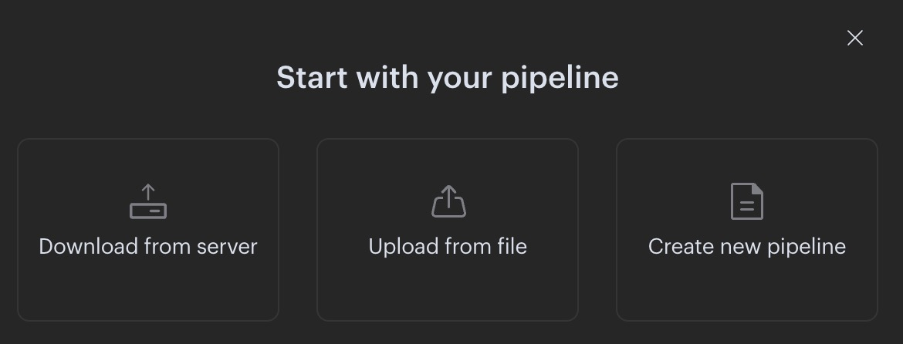</div>

- Click Cancel

  <div style="text-align: left;">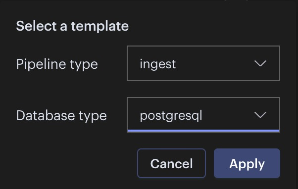</div>

- Copy and paste the configuration below into the Configuration file.

  ```
  targets:
    target:
      connection:
        type: redis
        host: 172.16.22.21
        port: 12000
  
  sources:
    psql:
      type: cdc
      logging:
        level: info
      connection:
        type: postgresql
        host: 172.16.22.7
        port: 5432
        database: chinook
        user: postgres
        password: postgres
                          
  ```

  
  <div style="text-align: left;">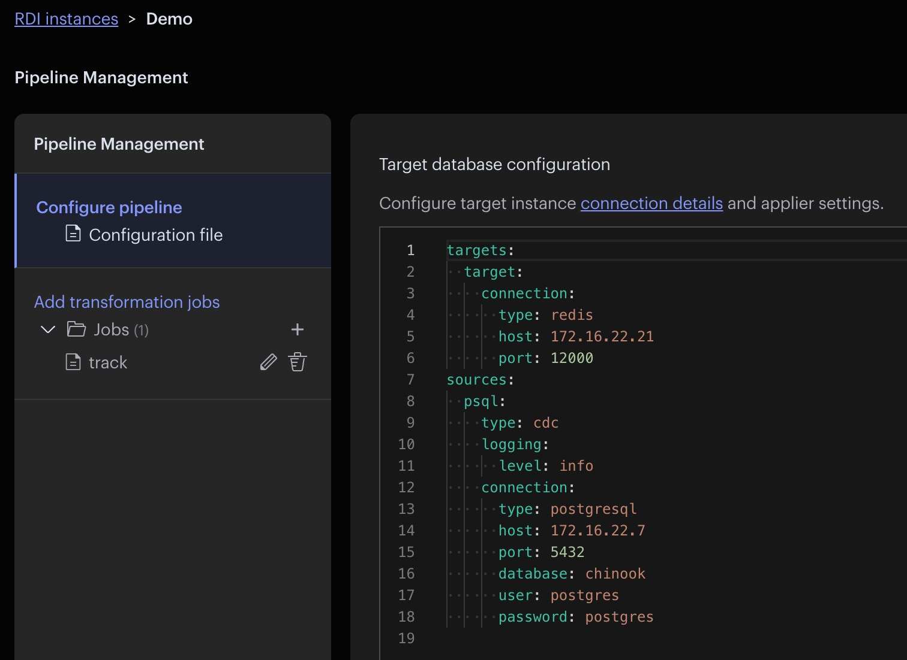</div>

- Click + enter the job name, Click the check icon. Select the job name and then copy and paste the configuration below into the job.

  ```
  source:
    table: Track
  
  transform:
    - uses: add_field
      with:
        field: NameUpper
        expression: upper("Name")
        language: sql
  
    - uses: filter
      with:
        expression: GenreId = 2
        language: sql
                  
  ```
  
  <div style="text-align: left;"></div>

- Click Deploy Pipeline..

  <div style="text-align: left;">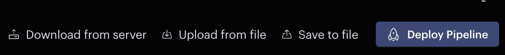</div>

- You will receive a confirmation below once it has been successfully deployed.

  <div style="text-align: left;">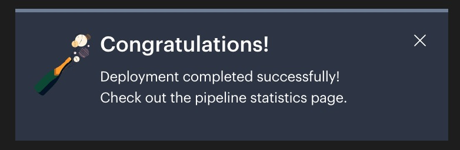</div>

- Go back, Click Configuration file, and then click Test Connection. You will see the connection test results.

  <div style="text-align: left;">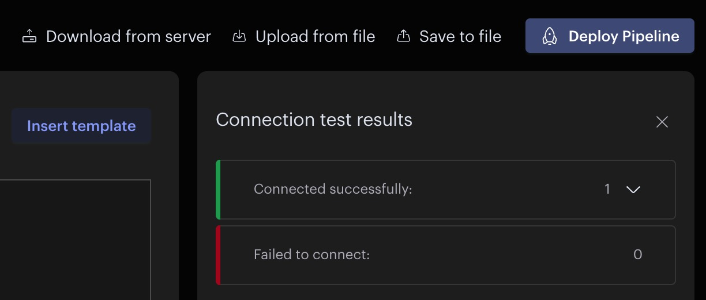</div>

### Step 3: Load data into the Track table


- Open <a href="https://7681-p-$HOSTNAME.$DOMAIN/" target="_blank">Terminal</a> You will be logged in as root@terminal


- SSH into loadgen

  ``` 
  ssh labuser@loadgen
  ```

- Generate INSERT statements against the Track table using a script.

  ```
  cd /scripts && python3 /scripts/generate_load.py
  ```

- Run a query against the Track table using <a href="https://3001-p-$HOSTNAME.$DOMAIN/" target="_blank">SQLPad</a>. Observe that records are now showing up in the table.

- Open the target-db connection through <a href="https://5540-p-$HOSTNAME.$DOMAIN/" target="_blank">Redis Insight</a> and observe there are records.

- Open the <a href="https://8081-p-$HOSTNAME.$DOMAIN/" target="_blank">Music App</a> and browse the selections.  Select "Jazz" from the dropdown. Since the app retrieves data from Redis, you should see a list of records that match the filter condition you applied previously in RDI.


### Step 4: Monitoring
- Click the pipeline status icon and observe that pipeline status in RedisInsight.

  <div style="text-align: left;">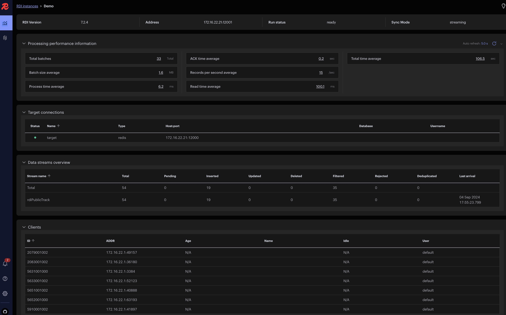</div>


- Also, in <a href="https://3000-p-$HOSTNAME.$DOMAIN/" target="_blank">Grafana</a>,
  - Log in with the username `admin` and password `redislabs`
  - Click the hamburger menu icon on the left side top corner then select Dashboards. You will find the following dashboards listed:
    - BDB Dashboard
    - Cluster Dashboard
    - Node Dashboard
    - PostgreSQL Database
    - RDI Dashboard


